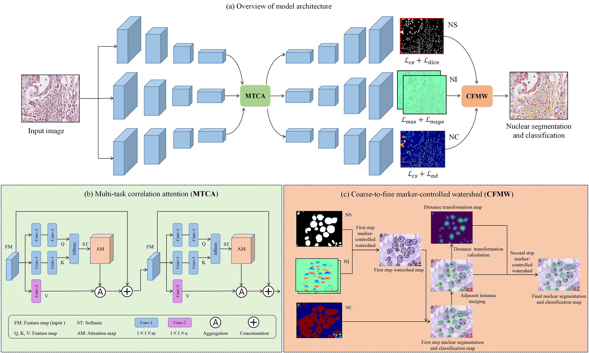

# SMILE: Cost-sensitive Multi-task Learning for Nuclear Segmentation and Classification with Imbalanced Annotations


This is the official PyTorch implementation of [**SMILE: Cost-sensitive Multi-task Learning for Nuclear Segmentation and Classification with Imbalanced Annotations.**](https://www.sciencedirect.com/science/article/pii/S1361841523001275)  We supply model weights trained on the following datasets:

- [CoNSeP](https://www.sciencedirect.com/science/article/pii/S1361841519301045)
- [MoNuSAC](https://ieeexplore.ieee.org/abstract/document/8880654)

Links to the checkpoints can be found in the inference description below.



## Set Up Environment

```
conda env create -f environment.yml
conda activate smile
pip install torch==1.7.1 torchvision==0.8.2
```

Above, we install PyTorch version 1.7.1 with CUDA 11.0. 

## Repository Structure

Below are the main directories in the repository: 

- `dataloader/`: the data loader and augmentation pipeline
- `docs/`: figures used in the repo
- `metrics/`: scripts for metric calculation
- `misc/`: utils that are
- `models/`: model definition, along with the main run step and hyperparameter settings  
- `run_utils/`: defines the train/validation loop and callbacks 

Below are the main executable scripts in the repository:

- `config.py`: configuration file
- `dataset.py`: defines the dataset classes 
- `extract_patches.py`: extracts patches from original images
- `run_train.py`: main training script
- `run_infer.py`: main inference script

# Running the Code

## Training

### Data Format
For training, patches must be extracted using `extract_patches.py`. For instance segmentation, patches are stored as a 4 dimensional numpy array with channels [RGB, inst]. Here, inst is the instance segmentation ground truth. I.e pixels range from 0 to N, where 0 is background and N is the number of nuclear instances for that particular image. 

For simultaneous instance segmentation and classification, patches are stored as a 5 dimensional numpy array with channels [RGB, inst, type]. Here, type is the ground truth of the nuclear type. I.e every pixel ranges from 0-K, where 0 is background and K is the number of classes.

Before training:

- Set path to the data directories in `config.py`
- Set path where checkpoints will be saved  in `config.py`
- Modify hyperparameters, including number of epochs and learning rate in `models/smile/opt.py`.

### Usage and Options

Usage: <br />
```
  python run_train.py [--gpu=<id>] [--view=<dset>]
```

Options:
```
  --gpu=<id>      Comma separated GPU list.  
```

Examples:

To initialise the training script with GPUs 0 and 1, the command is:
```
python run_train.py --gpu='0,1' 
```

## Inference

### Data Format
Input: <br />
- Standard images files, including `png`, `jpg` and `tiff`.

Output: <br />
- Output a `json` file with keys:
    - 'bbox': bounding box coordinates for each nucleus
    - 'centroid': centroid coordinates for each nucleus
    - 'contour': contour coordinates for each nucleus 
    - 'type_prob': per class probabilities for each nucleus (default configuration doesn't output this)
    - 'type': prediction of category for each nucleus
- Image tiles output a `mat` file, with keys:
    - 'raw': raw output of network (default configuration doesn't output this)
    - 'inst_map': instance map containing values from 0 to N, where N is the number of nuclei
    - 'inst_type': list of length N containing predictions for each nucleus
 - Image tiles output a `png` overlay of nuclear boundaries on top of original RGB image

### Model Weights

Model weights obtained from training SMILE as a result of the above instructions can be supplied to process input images. 

Segmentation and Classification:
- [CoNSeP checkpoint](https://drive.google.com/file/d/1lhDXb7Qrmi0plzCb9MK1SPU78f1cqgFR/view?usp=drive_link)
- [MoNuSAC checkpoint](https://drive.google.com/file/d/1ryzSZQ2nJB4lpAdj_4PGzQBTr-zzLZBR/view?usp=drive_link)


### Usage and Options

Usage: <br />
```
  run_infer.py [options] [--help] <command> [<args>...]
  run_infer.py --version
  run_infer.py (-h | --help)
```

Options:
```
  -h --help                   Show this string.
  --version                   Show version.

  --gpu=<id>                  GPU list. [default: 0]
  --nr_types=<n>              Number of nuclei types to predict. [default: 0]
  --type_info_path=<path>     Path to a json define mapping between type id, type name, 
                              and expected overlay color. [default: '']

  --model_path=<path>         Path to saved checkpoint.
  --model_mode=<mode>         'original' or 'fast'. [default: fast]
  --nr_inference_workers=<n>  Number of workers during inference. [default: 8]
  --nr_post_proc_workers=<n>  Number of workers during post-processing. [default: 16]
  --batch_size=<n>            Batch size. [default: 128]
```

Processing Options: <br />
```
   --input_dir=<path>     Path to input data directory. Assumes the files are not nested within directory.
   --output_dir=<path>    Path to output directory..

   --draw_dot             To draw nuclei centroid on overlay. [default: False]
   --save_qupath          To optionally output QuPath v0.2.3 compatible format. [default: False]
   --save_raw_map         To save raw prediction or not. [default: False]
```


The above command can be used from the command line or via an executable script. We supply two example executable scripts: one for tile processing and one for WSI processing. To run the scripts, first make them executable by using `chmod +x run_infer.sh`  Then run by using `./run_infer.sh` 

Intermediate results are stored in cache. Therefore ensure that the specified cache location has enough space! Preferably ensure that the cache location is SSD.

`type_info.json` is used to specify what RGB colours are used in the overlay. Make sure to modify this for different datasets and if you would like to generally control overlay boundary colours.

As part of our tile processing implementation, we add an option to save the output in a form compatible with QuPath. 

Take a look on how to utilise the output in `examples/usage.ipynb` [here](https://github.com/panxipeng/nuclear_segandcls/blob/main/examples/usage.ipynb). 


## Datasets

Download the CoNSeP dataset as used in our paper from [this link](https://warwick.ac.uk/fac/sci/dcs/research/tia/data/hovernet/). <br />
Download the MoNuSAC datsets from [this link](https://monusac-2020.grand-challenge.org/Data/).  <br />

Ground truth files are in `.mat` format, refer to the README included with the datasets for further information. 


## License

This project is licensed under the MIT License.

## Acknowledgement

Many thanks to these excellent open source projects:
- [HoVer-Net](https://github.com/vqdang/hover_net)
- [CCNet](https://github.com/speedinghzl/CCNet)

